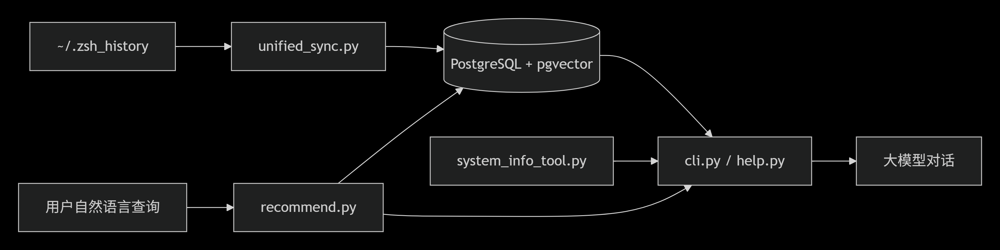
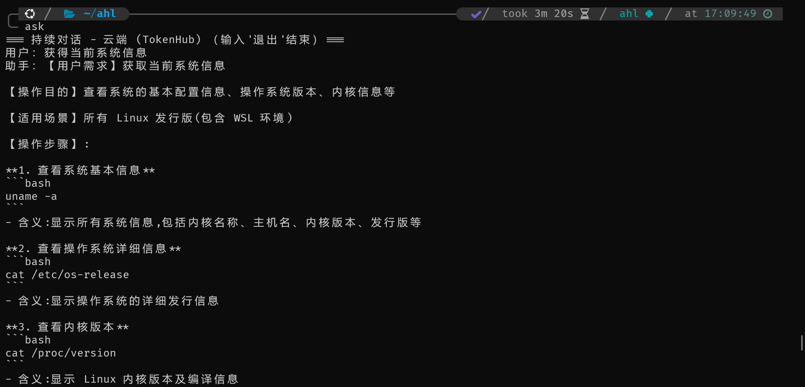
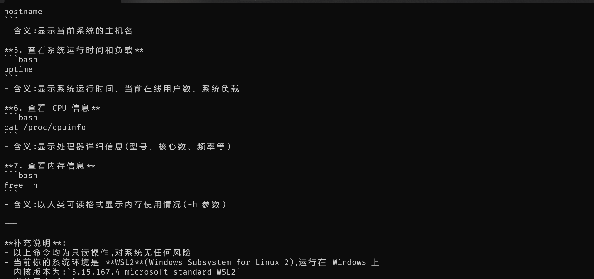
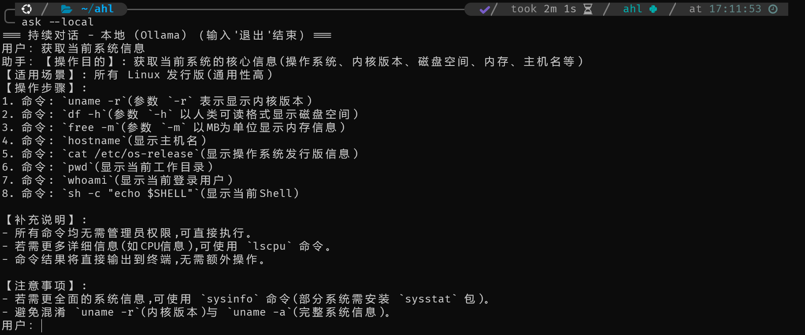

**命令行助手 (Command-Line Assistant)**

一个基于历史命令的智能推荐与对话系统，支持自然语言查询并推荐最相关的 Shell 命令，同时集成大语言模型进行辅助对话。系统通过向量相似度搜索和可执行性过滤，确保推荐结果安全可用，并支持增量同步历史记录。

✨ 功能特性
智能命令推荐
使用“列出当前目录”等自然语言查询，自动推荐历史中相关的 ls、ll 等命令，按相似度 + 频率排序。

增量历史同步
解析 ~/.zsh_history，支持多行命令合并、乱码清洗、频率统计，实时更新数据库。

可执行性过滤
只推荐系统中真实存在的命令（通过 shutil.which 验证），避免乱码或别名污染。

检索增强生成（RAG）
在对话模式下，系统会自动检索与用户问题最相关的历史命令，并注入大模型的上下文。模型能够结合历史习惯与当前系统环境（如当前目录、已安装工具）给出更精准、更安全的命令建议。

多模型支持（云端 & 本地 Ollama）

支持远程大模型 API（如 OpenAI 兼容接口），通过 .env 配置 API 密钥和地址。

支持本地部署 Ollama 模型（如 qwen3.5:4b），完全离线可用，保护隐私。

使用 --local 参数可一键切换到本地模型。

系统环境感知
自动收集当前目录、操作系统、已安装常用工具等信息，增强推荐精准度。

**系统架构**

**运行截图**

